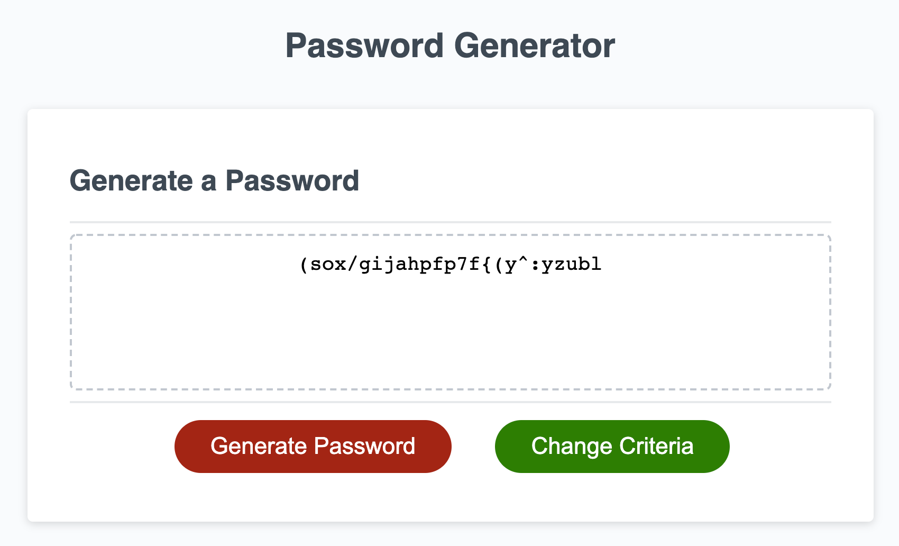

# Password Generator

## Link

As per the spec: https://daveholst.github.io/password-generator/
Alternative UI [new-ui branch]: https://password.daveholst.dev/

## Task

This week’s homework requires you to modify starter code to create an application that enables employees to generate random passwords based on criteria that they’ve selected. This app will run in the browser and will feature dynamically updated HTML and CSS powered by JavaScript code that you write. It will have a clean and polished, responsive user interface that adapts to multiple screen sizes.

The password can include special characters.

## Screenshot

## User Story

AS AN employee with access to sensitive data\
I WANT to randomly generate a password that meets certain criteria\
SO THAT I can create a strong password that provides greater security

## Acceptance Criteria

GIVEN I need a new, secure password
WHEN I click the button to generate a password

- [x] THEN I am presented with a series of prompts for password criteria
      WHEN prompted for password criteria
- [x] THEN I select which criteria to include in the password
      WHEN prompted for the length of the password
- [x] THEN I choose a length of at least 8 characters and no more than 128 characters
      WHEN prompted for character types to include in the password
- [x] THEN I choose lowercase, uppercase, numeric, and/or special characters
      WHEN I answer each prompt
- [x] THEN my input should be validated and at least one character type should be selected
      WHEN all prompts are answered
- [x] THEN a password is generated that matches the selected criteria
      WHEN the password is generated
- [x] THEN the password is either displayed in an alert or written to the page

## Notes / TODO

- [x] only validating with includes, would be more effective / handle more edge cases with a regex.
- [x] extra feature: have button to change generation criteria
- [x] extra feature: then have generate re-gen password based on previous criteria settings.
- [x] explore alternate UI with more modern / easy to use interface.
